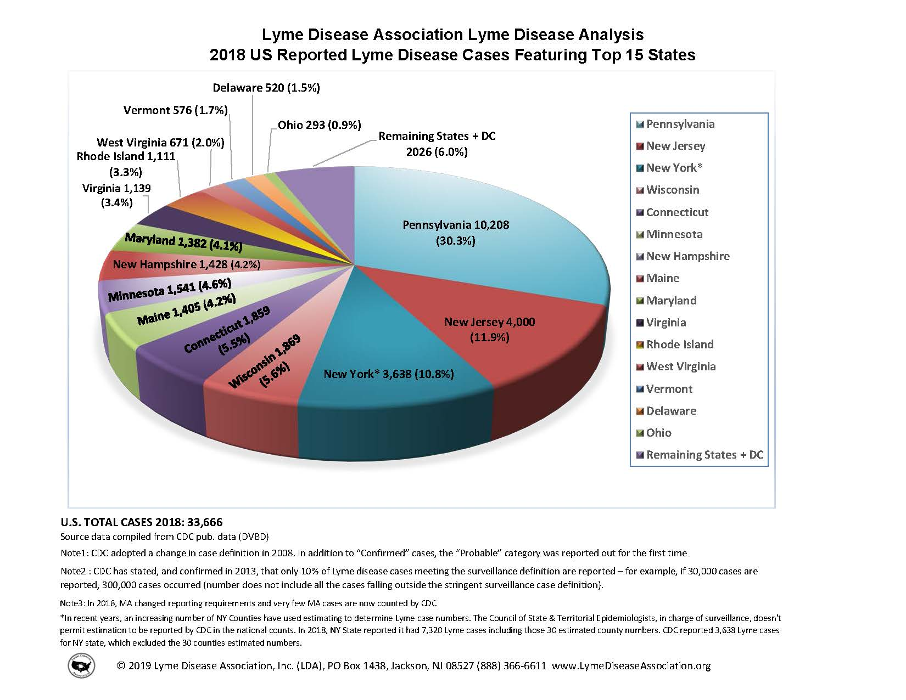

Visualization Redesign
================

## Background

The goal of this exercise is to recreate a series of pie chart in R and
then developing an improved presentation of the same data using some of
the design principals discussed in class.

The original pie charts come from the Lyme Disease Association and
reflect total lyme disease cases in
[2015](https://lymediseaseassociation.org/about-lyme/cases-stats-maps-a-graphs/2015-reported-lyme-cases-top-15-states/),
[2016](https://lymediseaseassociation.org/about-lyme/cases-stats-maps-a-graphs/2016-reported-lyme-cases-top-15-states/),
[2017](https://lymediseaseassociation.org/about-lyme/cases-stats-maps-a-graphs/2017-reported-lyme-cases-top-15-states/),
and
[2018](https://lymediseaseassociation.org/resources/2018-reported-lyme-cases-top-15-states/)
across a number of states.

## Task 1 - Recreation

For this task you will need to create a *single* data frame that can be
used to recreate the pie charts given above. The raw data is not
available so you will need to use the annotations in the visualization
provided to do this. PDF versions of plots are included in `plots/` if
some of the text or numbers are difficult to read.

We recommend that you create the new data frame using the `tibble()` or
the `tribble()` function from the tibble package.

With the data frame you should then recreate the pie charts, when
recreating the plots you do **not** need to: - use a 3D pie chart (2D is
sufficient)

-   match the colors / palette (the default ggplot2 colors or any other
    color palette is fine)

-   annotate the plot in the same way (a legend is sufficient)

-   match the entire caption (see below for what we want you to match)

However you should, - use a 2D pie chart

-   present a legend that shows the mapping of the colors to states
    (legend may be shared by all four pie charts, or each may have their
    own)

-   include title for all four pie charts

-   include the information in the first two lines of the caption (this
    can be in a singled combined caption or four separate captions)

 

## Task 2 - Redesign

Imagine that you have been hired by the state department of public
health in Connecticut t design an effective visualization for the risk
of lyme disease in that state (and potentially neighboring states).

Your result should be a single visualization (with or without facets) -
you must also include a short write up describing the specific goals of
your visualization (e.g. what are you attempting to communicate with the
visualization) and a discussion of your specific design choices for
accomplishing your goals.

You are welcome to augment the data from Task 1 with additional
information, but the focus should be on the original data.

Your visualization must be readable in the format presented in your
rendered document - adjusting [knitr chunk
options](https://yihui.org/knitr/options/) like `out.width`, `fig.asp`,
`dpi`, etc. are likely to be helpful

 